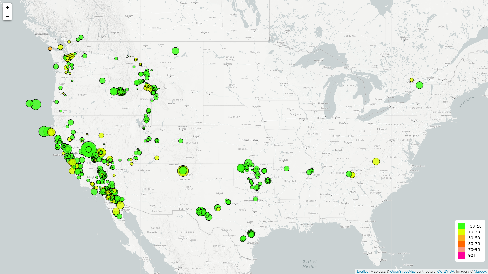
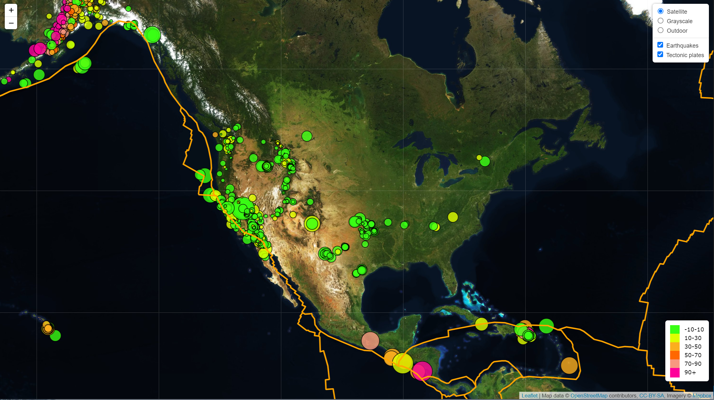

# Leaflet-Challenge: Visualizing Data with Leaflet

The United States Geological Survey is responsible for providing scientific data about natural hazards, the health of our ecosystems and environment; and the impacts of climate and land-use change. Their scientists develop new methods and tools to supply timely, relevant, and useful information about the Earth and its processes. 

Using a new set of tools, this challenge seeks to visualze their data allowing them to better educate the public and other organizations (and hopefully secure more funding...) on issues facing our planet.  We visualize earthquake and tectonic data specifically focusing on a meaningful way to display it.

### Level 1: Basic Visualization

The first task is visualizing an earthquake data set.  Find the dataset here: [USGS GeoJSON Past 7 Days](https://earthquake.usgs.gov/earthquakes/feed/v1.0/summary/all_week.geojson).  A map was created using Leaflet that plots all of the earthquakes in the previously mentioned data set based on their longitude and latitude.  Data markers reflect the magnitude of the earthquake by their size and the depth of the earthquake by color.  Earthquakes with higher magnitudes have a larger radius and earthquakes with greater depths are darker in color.  Popups are provided that when clicked give additional information such as place, date, time, magnitude, and depth.  A legend displays the colors used to represent the depth on the map.

* Leaflet-Step-1
   * images - images for readme, html and basic screenshot
   * static
      * css
         * style.css - style html
      * js
         * config.js - contains public mapbox key
         * logic.js - main file to run for analysis
   * index.html - main file to run for analysis

- - -

### Level 2: More Data 

The second task plots a second data set to illustrate the relationship between tectonic plates and seismic activity.  Find the tectonic plate data set here: [Tectonic Plate Boundries](https://raw.githubusercontent.com/fraxen/tectonicplates/master/GeoJSON/PB2002_boundaries.json).

You will need to pull in a second data set and visualize it along side your original set of data. Data on tectonic plates can be found at <https://github.com/fraxen/tectonicplates>.

In this step we are going to..

* Plot a second data set on our map.

* Add a number of base maps to choose from as well as separate out our two different data sets into overlays that can be turned on and off independently.

* Add layer controls to our map.

* Leaflet-Step-2
   * images - image for html, and bonus screenshots (3)
   * static
      * css
         * style.css - style html
      * js
         * config.js - contains public mapbox key
         * logic.js - main file to run for analysis
   * index.html - main file to run for analysis